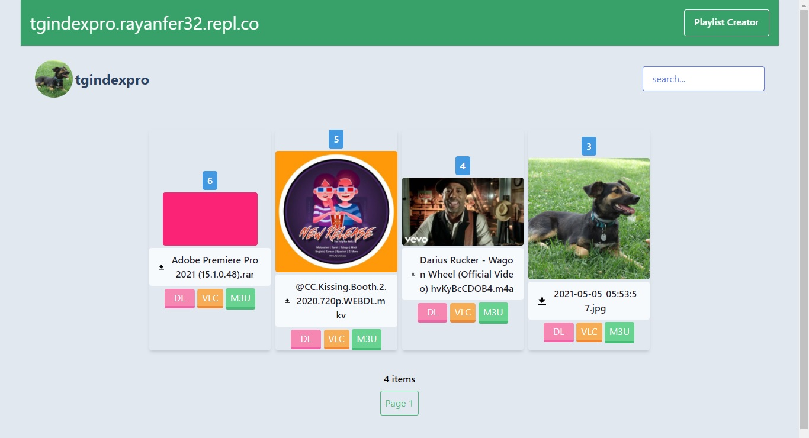

# Telegram Index Pro
**Get your media streaming right from your telegram chat into VLC player and web player. No Downloads to wait for!! Easy to Share !!**

[](.) [](LICENSE) []() []() [](https://hits.seeyoufarm.com)

## Deploy Now!
[](https://repl.it/github/Rayanfer32/TgindexPro)

## Highlights

* Create permanent/Static links for your telegram index (No interruptions if deployed on repl.it )
* Index of a selected channel/chat.
* Stream/Play media directly in VLC player
* View messages and media files on the browser.
* Search through the channel/chat.
* Download media files through browser/download managers.

## Demo

### https://tgindexpro.rayanfer32.repl.co



## Bonus content


## Deploy Guide

### One Click Deploy (Easy):
### Step 1:
> Click here > [](https://repl.it/github/Rayanfer32/TgindexPro)

### Step 2:
**Environment Variables.**


`Add these Environment Variables (Secrets) in the sidebar`

| Variable Name | Value
|------------- | -------------
| `API_ID` (required) | Telegram api_id obtained from https://my.telegram.org/apps.
| `API_HASH` (required) | Telegram api_hash obtained from https://my.telegram.org/apps.
| `INDEXING_CHAT` (required) | Chat_ID of the chat you are using for index (add `chat id echo bot` to ur group or channel and make it admin to show chat id) 

### Step 3:
#### Press `Run` button on top.
* Enter your phone number only (Bot token is not supported)
* Enter the recieved OTP

* Now copy the session string to the secrets.

| Variable Name | Value
|------------- | -------------
| `SESSION_STRING` (required) | String obtained by running `$ python3 app/generate_session_string.py`. (Login with the telegram account which is a participant of the given channel (or chat).

#### Press `Run` button on top to start the webserver.

### Step 4:
#### Preventing repl from going offline:
**Open** [uptimerobot.com](https://uptimerobot.com) **and add your index site under HTTP(s)**
>  This will ping the site every 5 minutes and prevent repl from shutting down.

## Manual Deployment:
* **Install dependencies.**
```bash
 pip3 install -U -r requirements.txt
```

* **Environment Variables.**
`PORT` (optional) | Port on which app should listen to, defaults to 8080.
`HOST` (optional) | Host name on which app should listen to, defaults to 0.0.0.0. 
`DEBUG` (optional) | Give some value to set logging level to debug, info by default.

* **Run app.**
```bash
$ python3 -m app
```

## API

Here's the api description. [API](https://github.com/odysseusmax/tg-index/wiki/API)

## Contributions

Contributions are welcome.

## Credits

Orignal Tgindex Developer [@odysseusmax](https://tx.me/odysseusmax).

## License
Code released under [The GNU General Public License](LICENSE).
